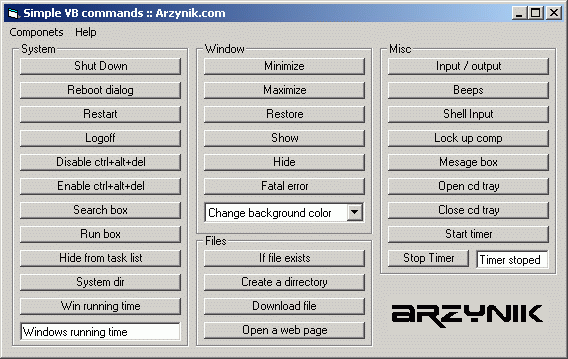



## Simple VB commands

### Description

This code had simple VB examples of how to: Open a cd tray, Close a CD tray, open the search box, open the run box, run a shell command, minimize, restore, maximize, show, hide, run a timer, define a variable, Shutdows, reboot, restart, logoff, dissable ctrl+alt+del, enable ctrl+alt+del, hide from task list, find the windows running time, generate a fatal error, change the background color of the window, determine if a file exists, create a directory, download a file, open a web page, get users input, open all types of message boxes, lock up a computer, beep, play mp3s, play music, connect with winsock, and much more.
 
### More Info
 

             |
---                |---
**Submitted On**   |2002-09-15 22:22:58
**By**             |[Devin Smith](https://github.com/Planet-Source-Code/PSCIndex/blob/master/ByAuthor/devin-smith.md)
**Level**          |Beginner
**User Rating**    |4.5 (18 globes from 4 users)
**Compatibility**  |VB 6\.0
**Category**       |[Windows API Call/ Explanation](https://github.com/Planet-Source-Code/PSCIndex/blob/master/ByCategory/windows-api-call-explanation__1-39.md)
**World**          |[Visual Basic](https://github.com/Planet-Source-Code/PSCIndex/blob/master/ByWorld/visual-basic.md)
**Archive File**   |[Simple\_VB\_1316649162002\.zip](https://github.com/Planet-Source-Code/devin-smith-simple-vb-commands__1-39036/archive/master.zip)

